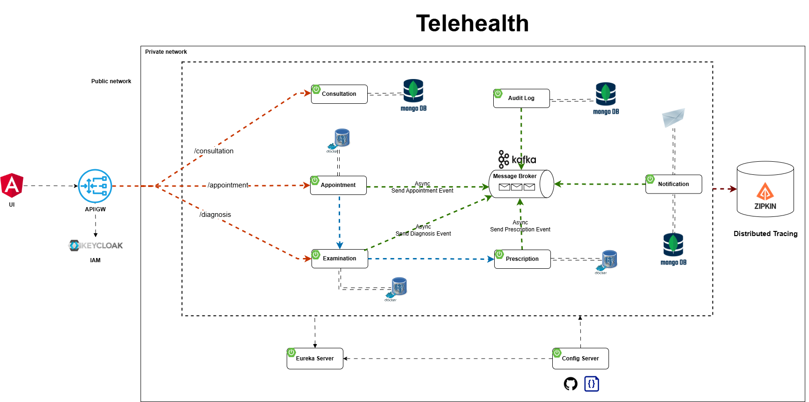

# Secure Telehealth E-Prescription System

English | [Tiếng Việt](README.vi.md)

## Project Description

This project presents a comprehensive solution for a Secure Telehealth E-Prescription System. In the evolving landscape of digital healthcare, this system addresses the critical need for secure, transparent, and compliant electronic prescription management. Leveraging a microservices architecture, event-driven design, and DevSecOps principles, it incorporates robust features like an Edge layer, API Gateway, specialized functional services, strong authentication, digital signatures, secure QR codes (SQRC), immutable audit trails, and full compliance with Vietnamese regulations (Circular 04/2022/TT-BYT). The system's primary goal is to ensure that every e-prescription is issued securely, transparently, traceable, and fully lawful, mitigating risks of forgery, unauthorized alterations, and misuse of sensitive medical information.

## Table of Contents

- [Project Description](#project-description)
- [System Objectives](#system-objectives)
- [Key Features](#key-features)
- [System Architecture](#system-architecture)
    - [Edge Layer and API Gateway](#edge-layer-and-api-gateway)
    - [Core Microservices](#core-microservices)
    - [Data Storage](#data-storage)
    - [Event Bus](#event-bus)
    - [Observability](#observability)
    - [Saga Choreography](#saga-choreography)
- [E-Prescription Security Details](#e-prescription-security-details)
    - [Authentication & Authorization](#authentication--authorization)
    - [X.509 Digital Signatures](#x509-digital-signatures)
    - [Secure QR Code (SQRC)](#secure-qr-code-sqrc)
    - [Verification Endpoint](#verification-endpoint)
    - [Audit Trail & Versioning](#audit-trail--versioning)
- [Technology Stack](#technology-stack)
- [Business Workflow](#business-workflow)
    - [Registration & Initial Consultation](#registration--initial-consultation)
    - [Appointment Booking](#appointment-booking)
    - [Clinical Examination & Diagnosis](#clinical-examination--diagnosis)
    - [Prescription Issuance](#prescription-issuance)
    - [Medical Record Update](#medical-record-update)
    - [Payment & Insurance Processing](#payment--insurance-processing)
- [Infrastructure & CI/CD Pipeline](#infrastructure--cicd-pipeline)
    - [Infrastructure Overview](#infrastructure-overview)
    - [GitLab CI/CD Pipeline Stages](#gitlab-cicd-pipeline-stages)
- [Benefits](#benefits)

## System Objectives

The system focuses on achieving five strategic objectives across the consultation, prescription, and medication delivery process:

-   **Authorized Issuance:** Restrict prescription creation solely to credentialed physicians.
-   **Digital Signature Integrity:** Utilize X.509 digital signatures to guarantee content integrity and authenticity and prevent tampering.
-   **Secure QR Code (SQRC):** Enable pharmacies to verify e-prescription status without exposing sensitive content.
-   **Immutable Audit Trail:** Maintain a tamper-proof log of all actions for comprehensive auditing and investigation.
-   **Regulatory Compliance:** Fully adhere to Circular 04/2022/TT-BYT and related directives.

## Key Features

Based on the objectives and description, the system provides the following key features:

-   Support for initial pharmacist-led consultations via chat.
-   Appointment scheduling and cancellation management.
-   Recording of clinical examination details, test results, and diagnoses.
-   Issuance of electronic prescriptions compliant with regulations.
-   Automatic generation of prescription codes compliant with Circular 04/2022/TT-BYT.
-   Application of X.509 digital signatures to prescriptions.
-   Generation of Secure QR Codes (SQRC) for prescriptions.
-   Updating and maintaining versioned electronic health records.
-   Payment processing and insurance integration.
-   Sending notifications via email, SMS, and push messages.
-   Executing analytical queries and generating KPI reports.
-   Recording immutable audit logs for all events.
-   User authentication (OAuth2/OpenID Connect) and authorization by role/scope.
-   Mandatory Multi-Factor Authentication (MFA) for physicians.
-   Secure API endpoint for verifying prescription status.

## System Architecture

<p align="center">
  
</p>

The system is built on a microservices architecture with an event-driven design.

### Edge Layer and API Gateway

All incoming user requests are initially handled at the Edge layer via Spring Cloud Gateway or Kong. The Gateway performs OAuth2/OpenID Connect authentication through Keycloak, enforces mandatory MFA for physicians, issues JWT tokens with role and scope claims, and applies rate-limiting and basic Web Application Firewall (WAF) protections.

### Core Microservices

The system comprises nine primary microservices, communicating through Apache Kafka:

| Service                | Description                                                                                                                                  |
|----------------------------|----------------------------------------------------------------------------------------------------------------------------------------------|
| **Consultation Service** | Facilitates preliminary pharmacist-led consultations via WebSocket chat and logs interactions.                                               |
| **Appointment Service** | Manages appointment scheduling and cancellation, emits events, and maintains history.                                                    |
| **Examination Service** | Records patient symptoms, test results, and diagnoses.                                                             |
| **Prescription Service** | Issues e-prescriptions (physician-only CRUD), generates compliant codes, digitally signs, renders SQRC, manages status.  |
| **Medical Records Service**| Aggregates data, supports versioning, provides tightly controlled query APIs.                                              |
| **Billing Service** | Processes payments (Stripe, PayPal), issues invoices, emits payment completed events.                                                      |
| **Notification Service** | Sends email, SMS, push notifications, integrates with scheduler and Kafka.                                                          |
| **Analytics Service** | Handles complex analytical queries and KPI reporting.                                                                                       |
| **Audit Log Service** | Captures immutable logs of all events with timestamps, actor IDs, and IP addresses.                                                                      |

### Data Storage

The storage infrastructure utilizes:

-   **PostgreSQL:** For core services requiring ACID properties and complex relational queries (Appointment, Examination, Billing, Medical Records, Prescription).
-   **MongoDB:** For services requiring schema flexibility.
-   **Elasticsearch:** For indexing, advanced analytics, and log searches, synchronized via scheduled replication or Debezium CDC.

### Event Bus

Apache Kafka provides reliable, real-time communication between system components, enabling the event-driven architecture.

### Observability

OpenTelemetry collects metrics and distributed traces. Prometheus, Grafana, and Loki are used for metrics collection, dashboarding, and log monitoring.

## Saga Choreography

A decentralized Saga pattern using Kafka events coordinates service interactions. Compensating events handle failures to ensure consistency.

```mermaid
flowchart LR
    subgraph "Saga Flow"
        direction LR
        A[Appointment Service]
        E[Examination Service]
        P[Prescription Service]
        S([Completed])
        F([Compensated])

        %% Success Path (top)
        A -- appointment.created --> E
        E -- examination.completed --> P
        P -- prescription.created --> S

        %% Compensation Path (bottom)
        A -- appointment.cancelled --> E
        E -- examination.compensated --> P
        P -- prescription.compensated --> F
    end

    classDef successPath stroke:#28a745,stroke-width:2px;
    classDef failurePath stroke:#d73a49,stroke-width:2px,stroke-dasharray: 5 5;

    linkStyle 0 class:successPath
    linkStyle 1 class:successPath
    linkStyle 2 class:successPath
    linkStyle 3 class:failurePath
    linkStyle 4 class:failurePath
    linkStyle 5 class:failurePath
```

## E-Prescription Security Details

Robust security measures are integrated throughout the system:

### Authentication & Authorization

Keycloak manages OAuth2/OpenID Connect authentication with mandatory MFA for physicians. JWT tokens with embedded claims are validated at the Edge Gateway.

### X.509 Digital Signatures

Certificates from a health authority are used for digital signatures. Private keys are stored in an HSM, and public keys are distributed. The Prescription Service signs documents (PDF/JSON) before encryption.

### Secure QR Code (SQRC)

A sign-then-encrypt model is employed. The encrypted payload (Prescription ID, SHA-256 hash, digital signature) is embedded in the QR code. Verification requires calling the Prescription Service endpoint.

### Verification Endpoint

An external endpoint (`GET /api/prescriptions/verify/{prescriptionId}`) allows authorized parties (e.g., pharmacies) to retrieve a JSON response containing `valid`, `status` (issued | used | expired), `physicianDetails`, `issuedAt`, and `expiresAt` fields.

### Audit Trail & Versioning

Every operation is logged immutably to Kafka and the Audit Log Service. Updates create new version records with timestamps, actor IDs, and IP addresses for full traceability.

## Technology Stack

The project utilizes the following key technologies:

-   **Gateway/API Management:** Spring Cloud Gateway, Kong
-   **Identity & Access Management:** Keycloak (OAuth2/OpenID Connect, JWT, MFA)
-   **Event Streaming:** Apache Kafka
-   **Database:** PostgreSQL (Relational), MongoDB (Document)
-   **Search & Analytics:** Elasticsearch
-   **Change Data Capture (CDC):** Debezium
-   **Observability:** OpenTelemetry, Prometheus, Grafana, Loki
-   **Security:** X.509 Digital Signatures, Hardware Security Module (HSM), SQRC (Sign-then-Encrypt), SAST (SonarQube), DAST (Arachni), Image Scanning (Trivy)
-   **Build & Packaging:** Maven, Docker
-   **CI/CD:** GitLab CI/CD
-   **Testing:** JUnit, Mockito, H2 (embedded DB), k6 (Performance Testing)
-   **Deployment:** Ubuntu, docker-compose, Harbor (Private Docker Registry), SSH

## Business Workflow

The system supports the following business workflow:

### Registration & Initial Consultation

Patients register and verify their accounts. They can then initiate a pharmacist-led pre-consultation via the Consultation Service for initial triage.

### Appointment Booking

Patients schedule appointments with physicians using the Appointment Service, which validates credentials and sends notifications.

### Clinical Examination & Diagnosis

Physicians conduct in-person examinations, recording symptoms, test results, and diagnoses in the Examination Service. Relevant Kafka events are emitted.

### Prescription Issuance

Based on the diagnosis, physicians issue e-prescriptions via the Prescription Service. The system handles compliant code generation, digital signing, encryption, and SQRC rendering.

### Medical Record Update

Immediately after issuance, the Medical Records Service aggregates data from various services to update the patient's electronic health record, maintaining version history.

### Payment & Insurance Processing

Patients complete payments using the Billing Service, which integrates with payment gateways and insurance APIs. Successful payments trigger events that update medical records.

## Infrastructure & CI/CD Pipeline

<p align="center">
  
</p>

### Infrastructure Overview

The solution is deployed across five Ubuntu servers: four on-premises VMs (GitLab server, build server, development server, database server) and one Amazon EC2 instance (hosting a private Docker Registry).

### GitLab CI/CD Pipeline Stages

A six-stage GitLab CI/CD pipeline is triggered by every code push, running on dedicated runners:

| Stage                     | Description                                                                                                                               |
|---------------------------|-------------------------------------------------------------------------------------------------------------------------------------------|
| **Build** | The build server executes `mvn clean package` and builds Docker images tagged by commit SHA.                                                               |
| **Test Source Code** | Runs SAST (SonarQube), unit tests (JUnit/Mockito), and integration tests (embedded H2/PostgreSQL). SonarQube enforces quality/security gates. |
| **Push** | Pushes Docker images to the private Harbor registry. Fails if push is unsuccessful.                                                       |
| **Security Scan Image** | Trivy scans container images for HIGH/CRITICAL CVEs. Fails on blocking vulnerabilities.                                             |
| **Deploy** | Pulls new images onto the development server via SSH and deploys using `docker-compose`.                                                    |
| **Security Scan Website** | Performs DAST with Arachni against the staging URL to find vulnerabilities like XSS, CSRF, IDOR.                                            |
| **Performance Testing** | Simulates load using k6 (e.g., 50 virtual users for 2 minutes). Fails if p95 latency > 300 ms or error rate > 3%.                         |

Logs, metrics, test reports, and scan artifacts are centrally stored for traceability.

## Benefits

The Secure Telehealth E-Prescription System delivers four key advantages:

-   **Absolute Security:** Digital signatures and SQRC eliminate the risk of prescription forgery or tampering.
-   **Complete Transparency:** An immutable audit trail ensures end-to-end visibility and traceability, facilitating audits and regulatory inspections.
-   **Regulatory Compliance:** The system rigorously adheres to health ministry guidelines on prescription formatting, data retention, and expiration.
-   **Scalable & Agile Architecture:** Microservices, event-driven design, and DevSecOps practices enable rapid deployment, seamless scalability, and straightforward third-party integrations.

## Further Information

For a more detailed analysis of the project, including in-depth design choices, implementation details, and evaluation results, please refer to the full project report:

[Link to Detailed Project Report](document/report/REPORT.md)